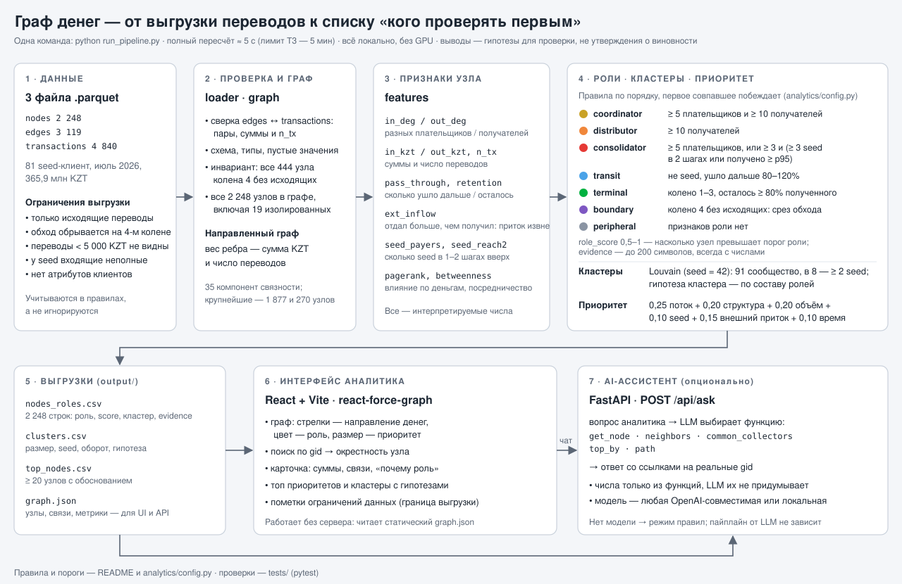

# Граф денег — MoneyGraph AI

Решение команды **STNDZ MAIN** для HackAlem AI. По обезличенной сети переводов инструмент помогает AML-аналитику ответить: **«кого смотреть первым и почему?»** Движок рассчитывает структурные и временные признаки, назначает объяснимую роль каждому из 2 248 узлов, выделяет сообщества и формирует топ-30 для проверки. Веб-интерфейс показывает направления переводов, роли, карточку и связи найденного клиента; опциональный AI-ассистент отвечает на вопросы по графу. Результат — гипотезы по наблюдаемым данным, а не утверждения о виновности.

Объяснение без технических подробностей: [как устроен проект и кто за что отвечает](docs/PROJECT_EXPLAINED.md). Сценарий защиты: [docs/DEMO_SCRIPT.md](docs/DEMO_SCRIPT.md).

## Быстрый старт

Команды выполняются **из корня репозитория**. Нужен **Python 3.12+** (проверенная среда: 3.12.10; проверить: `python --version`): `networkx` зафиксирован на 3.7 ради воспроизводимых кластеров, а эта версия не ставится на Python 3.11 и более ранних версиях. Для интерфейса — Node.js 22.12+ и npm. В `data/` должны лежать три исходных `.parquet`. Аналитика и интерфейс работают локально; LLM, GPU и интернет не требуются.

### 1. От исходных данных до всех выгрузок — одна команда

Для Bash или PowerShell 7:

```sh
python -m pip install -r requirements.txt && python run_pipeline.py
```

Для Windows PowerShell 5.1 (без поддержки `&&`):

```powershell
python -m pip install -r requirements.txt; if ($LASTEXITCODE -eq 0) { python run_pipeline.py }
```

Рекомендуется предварительно создать виртуальную среду: `python -m venv .venv`, затем `source .venv/bin/activate` (Bash) или `.venv\Scripts\Activate.ps1` (PowerShell). Без активации используйте `.venv/Scripts/python.exe` (Windows) или `.venv/bin/python` (Linux/macOS).

Команда за ≈ 5 секунд (лимит ТЗ — 5 минут) создаёт в `output/`: `nodes_roles.csv`, `clusters.csv`, `top_nodes.csv` и `graph.json`. Три CSV из последнего прогона уже лежат в репозитории — их можно посмотреть без запуска; повторный прогон воспроизводит их побайтно. Параметры: `--data-dir` (по умолчанию `data`), `--output-dir` (по умолчанию `output`).

### 2. Открыть интерфейс

```sh
npm --prefix frontend ci
npm --prefix frontend run dev
```

Откройте адрес из терминала, обычно **http://localhost:5173**. Перед стартом `dev` и `build` автоматически копируют `output/graph.json` в `frontend/public/data/` (скрипт `sync-data`); после нового прогона движка перезапустите `dev` или выполните `npm --prefix frontend run sync-data` и обновите страницу. Сервер API для интерфейса не обязателен — без него недоступен только чат ассистента.

Сборка для показа без dev-сервера: `npm --prefix frontend run build`, затем `npm --prefix frontend run preview` (обычно **http://localhost:4173**).

### 3. Проверить результат

```sh
python -m pip install -r backend/requirements.txt
python -m pytest tests -v
```

`tests/analytics/` — модульные проверки движка (признаки, роли, кластеры, приоритет, временные признаки, контракт выгрузки). `tests/integration/` запускает `run_pipeline.py` с нуля во временные каталоги и проверяет требования ТЗ: 2 248 строк, роли из словаря, скоры в [0, 1], evidence с числами и не длиннее 200 символов, ни один узел среза на 4-м колене не `terminal`, ни один seed не `transit`, кластеры покрывают все узлы, топ ≥ 20 и отсортирован, побайтный детерминизм двух прогонов, время < 300 с; а также API и ассистента. Рабочая папка `output/` при этом не перезаписывается.

## Схема решения



Файл схемы: [`docs/solution_scheme.svg`](docs/solution_scheme.svg), подходит и как слайд для защиты.

| Часть | Где | Технологии |
|---|---|---|
| Движок | `analytics/`, `run_pipeline.py` | Python, pandas, NumPy, NetworkX 3.7, SciPy |
| Интерфейс | `frontend/` | React 19, Vite, react-force-graph-2d |
| API и ассистент (опционально) | `backend/` | FastAPI; LLM через OpenAI-совместимый API или без LLM на правилах |

Пороги и константы движка собраны в [`analytics/config.py`](analytics/config.py); решения с обоснованием — [`docs/GRAPH_DECISIONS.md`](docs/GRAPH_DECISIONS.md).

## Входные данные

| Файл | Строк | Поля |
|---|---:|---|
| `data/nodes.parquet` | 2 248 | `gid`, `depth`, `is_seed` |
| `data/edges.parquet` | 3 119 | `src`, `dst`, `sum_kzt`, `n_tx`, `depth` |
| `data/transactions.parquet` | 4 840 | `src`, `dst`, `date`, `sum_kzt` |

81 seed, период **1–31 июля 2026**, сумма рёбер **365 890 012,01 KZT**. Ребро направлено от плательщика к получателю. Перед расчётом движок сверяет рёбра с транзакциями (пары, суммы, число переводов), проверяет, что все 444 узла 4-го колена без исходящих, и добавляет в граф все 2 248 узлов, включая 19 изолированных. Стартовый код организаторов — в `starter/`, полное ТЗ — в [context/TASK.md](context/TASK.md).

`gid` — идентификатор, а не число: в JSON и API он передаётся **строкой**. При чтении CSV задавайте строковый тип (`pd.read_csv(path, dtype={"gid": "string"})`); табличные редакторы и JavaScript number теряют младшие разряды 18-значного идентификатора.

## Признаки узла

| Признак | Расчёт | Зачем |
|---|---|---|
| `in_deg`, `out_deg` | число разных плательщиков / получателей | сбор / веерная раздача |
| `in_kzt`, `out_kzt`, `in_tx`, `out_tx` | суммы и число переводов | сумма и частота — разные сигналы |
| `pass_through` | `out_kzt / in_kzt` (нет при `in_kzt = 0`) | транзит ≈ 1 |
| `retention` | `1 − pass_through` | удержание средств |
| `ext_inflow` | `max(0, out_kzt − in_kzt)` | отдал больше, чем получил от наблюдаемых клиентов: источник вне выборки |
| `seed_payers` | seed среди прямых плательщиков | прямой сбор с известных клиентов |
| `seed_reach2` | разные seed на входящих обходах длиной 1–2 | сходимость денег seed |
| `pagerank` | PageRank с весом `sum_kzt` по направлению переводов | влияние по деньгам |
| `betweenness` | точная, на направленном графе | посредничество |
| `fast_share` | доля исходящих сумм с наблюдаемым входящим переводом в окне 0–2 дня | временное совпадение потоков |
| `sync_in_max` | максимум разных плательщиков за один календарный день | синхронный сбор |

`fast_share` не доказывает, что отправлены именно полученные деньги; дата без времени не позволяет установить порядок переводов внутри дня. `seed_reach2` при двухшаговом цикле может учитывать seed самого узла — это число seed на коротких входящих обходах, а не число независимых источников.

## Роли: первое совпавшее правило побеждает

| Порядок | Роль | Условие | Узлов |
|---:|---|---|---:|
| 1 | `coordinator` | `in_deg ≥ 5` и `out_deg ≥ 10` | 15 |
| 2 | `distributor` | `out_deg ≥ 10` | 49 |
| 3 | `consolidator` | `in_deg ≥ 5`; или `in_deg ≥ 3` и `seed_reach2 ≥ 3`; или `in_deg ≥ 3` и `in_kzt ≥ 613 779 KZT` (p95) | 69 |
| 4 | `transit` | не seed; `in_deg > 0`, `out_deg > 0`, `0.8 ≤ pass_through ≤ 1.2` | 67 |
| 5 | `terminal` | `depth < 4`, `in_deg > 0`, `retention ≥ 0.8` | 1 158 |
| 6 | `boundary` *(расширение словаря)* | колено 4 и `out_deg = 0` | 444 |
| 7 | `peripheral` | ни одно правило не сработало | 446 |

Пороги откалиброваны по распределениям данных: ≥ 5 плательщиков — топ-2% узлов, ≥ 10 получателей — топ-3%.

- **Почему `coordinator` проверяется первым.** Главные сборщики в данных одновременно раздают средства (например, 19 плательщиков → 61 получатель): правило «много входящих и мало исходящих» их бы пропустило.
- **Почему `boundary` — отдельная роль.** Обход выгрузки остановился на 4-м колене, исходящие этих узлов не собирались. Наивное «нет исходящих ⇒ деньги осели» дало бы 444 ложных конечных получателя. На коленах 1–3 обход продолжался, поэтому отсутствие исходящих там — наблюдаемый факт, и `terminal` обоснован.
- **Почему seed не бывает `transit`.** Граф собран от seed по исходящим, их входящие извне выборки не видны, `pass_through` для них некорректен.

`role_score` ∈ [0,5; 1] показывает, насколько узел превышает порог своей роли (например, для `distributor` — `out_deg / 60`, приведённый к диапазону); это эвристика, а не вероятность нарушения. `evidence` — до 200 символов, всегда с числами, например: «Признаки координации: 5 плательщиков → 99 получателей; оборот 24 млн KZT; достижимы seed-клиенты: 3 в пределах 2 шагов». У seed evidence отдельно предупреждает о неполноте входящих данных.

## Приоритет: кого смотреть первым

Каждая компонента приведена к [0, 1]; первые три — перцентильные ранги по всем узлам:

```text
priority = 0.25 · flow        перцентиль max(in_deg, out_deg)
         + 0.20 · structure   среднее перцентилей pagerank и betweenness
         + 0.20 · volume      перцентиль log(1 + in_kzt + out_kzt)
         + 0.10 · seed_conv   min(1, seed_reach2 / 3)
         + 0.15 · external    min(1, ext_inflow / 1 000 000)
         + 0.10 · temporal    max(fast_share, min(1, sync_in_max / 3))

× 0.8           для seed — они уже известны, цель — новые узлы выше по цепочке
не выше 0.3     для boundary, peripheral и изолированных
```

`top_nodes.csv` — 30 узлов с наибольшим приоритетом; поле `why` объясняет позицию числами. Первое место текущей выгрузки — `100000000331309100` (`coordinator`): 5 плательщиков → 99 получателей, получено 0,98 млн KZT, отправлено 23 млн KZT.

## Кластеры

Louvain с `weight="sum_kzt"` и `seed=42` на NetworkX 3.7 даёт **91 сообщество, 8 из них содержат более одного seed**; все 19 изолированных узлов — отдельные кластеры. Кластеризация работает на **неориентированной** проекции: вес пары равен сумме переводов в обоих направлениях. Простой `G.to_undirected()` здесь неприменим: он терял одно из встречных значений. Узлы и рёбра добавляются в фиксированном порядке, поэтому перестановка строк parquet не меняет результат (D-015). Направление денег учитывается в ролях. `sum_kzt_internal` — сумма направленных рёбер с обоими концами внутри кластера, `top_gids` — до пяти узлов с наибольшим приоритетом.

`hypothesis` — первое сработавшее правило по составу ролей:

| Условие | Гипотеза |
|---|---|
| ≥ 2 seed и есть `consolidator` | признаки сбора средств нескольких seed |
| есть `coordinator` и `distributor` | признаки распределительной сети |
| > 50% узлов — `terminal` | признаки конечного оседания средств |
| > 50% узлов — `boundary` | граница выгрузки, структура неполна |
| иначе | выраженная функция не выявлена |

## Выгрузки

| Файл | Содержание |
|---|---|
| `output/nodes_roles.csv` | 2 248 строк: обязательные `gid, role, role_score, cluster_id, priority_score, evidence` и признаки узла |
| `output/clusters.csv` | `cluster_id, n_nodes, n_seed, sum_kzt_internal, top_gids, hypothesis`; `top_gids` через `;` |
| `output/top_nodes.csv` | 30 строк: `rank, gid, role, priority_score, why` |
| `output/graph.json` | данные интерфейса и API: `meta`, `nodes` (`gid`, признаки в `metrics`, флаги в `flags`), `edges` (`src`, `dst`), `clusters` |

Контракт `graph.json` и словарь флагов (`truncated_by_depth`, `seed_inflow_incomplete`, `outflow_exceeds_inflow`, `isolated`, `external_funding`) — [docs/GRAPH_DATA_CONTRACT.md](docs/GRAPH_DATA_CONTRACT.md).

## Интерфейс аналитика

Режимы: **Network** — топ-узлы с окружением; **Hunt** — найденный узел и его связи; **Priority** — топ-лист; кластер — выбранное сообщество. Журнал и история отдельных переводов заполняются, только если `graph.json` содержит `transactions`; текущая выгрузка движка их не включает. Цвет узла — роль, размер — приоритет, стрелки — направление денег. Поиск по полному `gid` открывает карточку: роль, evidence, суммы, контрагенты. Панель ассистента отправляет вопрос в `/api/ask` через прокси Vite (по умолчанию `http://127.0.0.1:8000`, переопределяется переменной `API_PROXY`); gid в ответе кликабельны.

## Ограничения данных и метода

- **Обход только по исходящим на четыре колена.** У 444 узлов 4-го колена исходящие не собирались — роль `boundary`, вывод об оседании не делается.
- **Неполные входящие, особенно у seed.** `in_kzt − out_kzt` — сальдо внутри выборки, не банковский баланс. `ext_inflow` показывает, что источник средств не виден, но не доказывает его характер.
- **Порог 5 000 KZT, один банк, один месяц.** Дробление ниже порога, межбанковские переводы и операции за пределами июля невидимы. Даже `terminal` — гипотеза в этих пределах.
- **Нет клиентских атрибутов и размеченных ролей.** Пороги эвристические; качество оценивается обоснованностью правил, а не accuracy.
- **Перцентильный приоритет относителен.** Он ранжирует узлы внутри этой выгрузки и меняется при изменении выборки.
- **Воспроизводимость.** Louvain с `seed=42`, NetworkX 3.7 и фиксированным порядком графа дают одинаковые выгрузки. Тесты сравнивают CSV побайтно при повторном запуске и перестановке всех входных строк; JSON совпадает за исключением времени генерации. На другой версии NetworkX число кластеров может отличаться.

## Масштабирование до ~1 млн узлов

Это план развития, а не заявленный результат бенчмарка. Требования к памяти и времени зависят также от числа рёбер и транзакций.

| Компонент сейчас | Изменение на большом графе |
|---|---|
| pandas, загрузка всего набора | Polars lazy / DuckDB, чтение нужных колонок Parquet, агрегирование по частям; степени и суммы — за `O(V + E)` |
| NetworkX и Python-объекты | компактные индексы/CSR, igraph либо nx-cugraph на GPU при наличии ресурсов; соответствие строковых gid внутренним индексам |
| Точная betweenness | приближённая по выборке `k` источников с фиксированным seed; проверить стабильность топа при разных `k` |
| Louvain | Leiden; заново проверить качество сообществ |
| Перцентили приоритета | приближённые квантили (t-digest) вместо полной сортировки |
| Полный `graph.json` в памяти API и браузера | хранилище узлов/рёбер с индексами по gid, src, dst; постраничные запросы, окрестности по требованию |
| Отрисовка подграфа | только окрестности и топ-N, агрегированные узлы кластеров, жёсткие лимиты выдачи |

Перед переносом: заменить проверку «ровно 2 248 строк» на покрытие входного множества узлов, измерить время и пик памяти на синтетических графах нескольких размеров, сравнить топы и роли с малым эталоном. GPU — возможная оптимизация, а не обязательное условие запуска.

## API и AI-ассистент (опционально)

```sh
python -m pip install -r backend/requirements.txt
python -m uvicorn backend.main:app --port 8000
```

В другом терминале: `curl http://localhost:8000/api/health` (в Windows при необходимости `curl.exe`). Ожидаются `status: "ok"`, `source: "output/graph.json"`, `nodes: 2248`, `links: 3119`. Swagger: **http://localhost:8000/docs**.

API ничего не пересчитывает: при старте читает готовый `graph.json` и строит индексы. Порядок поиска: `output/graph.json` → `out/graph.json` → `frontend/public/data/graph.json`; файл можно задать явно через `MONEYGRAPH_GRAPH_JSON`. После нового прогона движка перезапустите сервер.

### Карточка узла и оценка полноты: `GET /api/nodes/{gid}/card`

Справка по клиенту: роль и evidence, потоки, топ-3 плательщика и получателя по сумме, блок «на что обратить внимание» и **пробелы в данных с рекомендуемым следующим запросом**:

| Условие | Пробел | Следующий запрос |
|---|---|---|
| колено 4 без исходящих | исходящие не собирались | исходящие переводы клиента |
| seed-клиент | входящие извне выборки не видны | все входящие, включая межбанковские |
| не seed, отправил ≥ 2× и на ≥ 1 млн KZT больше, чем получил | источник разницы не виден | входящие, включая межбанковские |
| нет переводов в выгрузке | переводов от 5 000 KZT нет | полная выписка, включая < 5 000 KZT |
| всегда | переводы < 5 000 KZT и межбанковские не видны | операции ниже порога при признаках дробления |

Неизвестный gid — 404.

### Устойчивость сети: `GET /api/resilience?n=10`

Изымает `n` (1–100) узлов с наибольшим `priority_score` и сравнивает связность сети до и после: число компонент, размер крупнейшей, seed в ней (без учёта направления переводов). Если приоритет не рассчитан, используется `betweenness`; поле `ranked_by` показывает, что использовано. На текущей выгрузке изъятие топ-10 разбивает сеть с 35 до 242 компонент, крупнейшая сокращается с 1 877 до 1 534 узлов.

### Ассистент: `POST /api/ask`

Без настройки LLM работает разбор типовых вопросов по правилам. Локальная модель Ollama работает в режиме `llm` без ключа — см. ниже. Пример в Bash:

```sh
curl -sS http://localhost:8000/api/ask -H 'Content-Type: application/json' -d '{"question":"Топ 5 по priority_score","selected_gid":null}'
```

В PowerShell:

```powershell
Invoke-RestMethod -Method Post -Uri http://localhost:8000/api/ask -ContentType 'application/json; charset=utf-8' -Body '{"question":"Топ 5 по priority_score","selected_gid":null}'
```

Поддерживаются карточка узла, входящие/исходящие соседи, общие прямые получатели указанных узлов, топ по метрике и направленный путь.

Для LLM с OpenAI-совместимым Chat Completions и tool calling задайте переменные **перед запуском сервера** или запишите их в локальный `backend/.env` (исключён из Git); переменные процесса важнее файла:

| Переменная | Значение |
|---|---|
| `LLM_PROVIDER` | `openai` (по умолчанию) или `ollama` для локальной модели без ключа |
| `LLM_BASE_URL` | базовый URL API с префиксом, например `https://api.openai.com/v1`; приложение добавляет `/chat/completions` |
| `LLM_API_KEY` | ключ внешнего провайдера; для Ollama пустой. В режиме `openai` пустой ключ включает разбор по правилам |
| `LLM_MODEL` | идентификатор модели у провайдера |
| `LLM_TIMEOUT_SECONDS` | лимит времени на один вопрос, по умолчанию 30 секунд |

LLM только выбирает функции `get_node`, `neighbors`, `common_collectors`, `top_by`, `path`, `node_card` (пробелы в данных и следующий запрос). Ссылки на gid разрешены только из вопроса, выбранного узла или полученных результатов. Итоговые суммы, связи и карточки строятся серверными шаблонами **из результатов функций**; свободный текст модели в ответ не попадает. При ошибке провайдера срабатывает фолбэк на правилах.

Запрос: `{"question": "...", "selected_gid": null | "<gid>"}`; явные gid в вопросе важнее выделения. Ответ: `answer`, `gids` (строковые идентификаторы упомянутых существующих узлов), `mode` (`llm` или `rules`). Подробный контракт и примеры вопросов — [docs/COPILOT_API.md](docs/COPILOT_API.md).

### Локальная LLM без API-ключа

Установите [Ollama](https://ollama.com/download), затем из корня репозитория:

```sh
ollama pull qwen3:4b
ollama create moneygraph-qwen3:4b -f backend/ollama.Modelfile
```

Скопируйте `backend/.env.example` в `backend/.env`, если локального файла ещё нет, и перезапустите FastAPI. Профиль использует Ollama на `http://127.0.0.1:11434/v1`, API-ключ не нужен. Данные не покидают машину.

Проверить именно LLM, а не фолбэк:

```sh
python -m backend.check_copilot --all
```

Команда проверяет шесть типов вопросов и завершается ошибкой при `mode="rules"`. Установка, настройки, диагностика — [docs/OLLAMA_SETUP.md](docs/OLLAMA_SETUP.md). Ollama опциональна: без неё ассистент отвечает по правилам, а движок, выгрузки и интерфейс от LLM не зависят.
