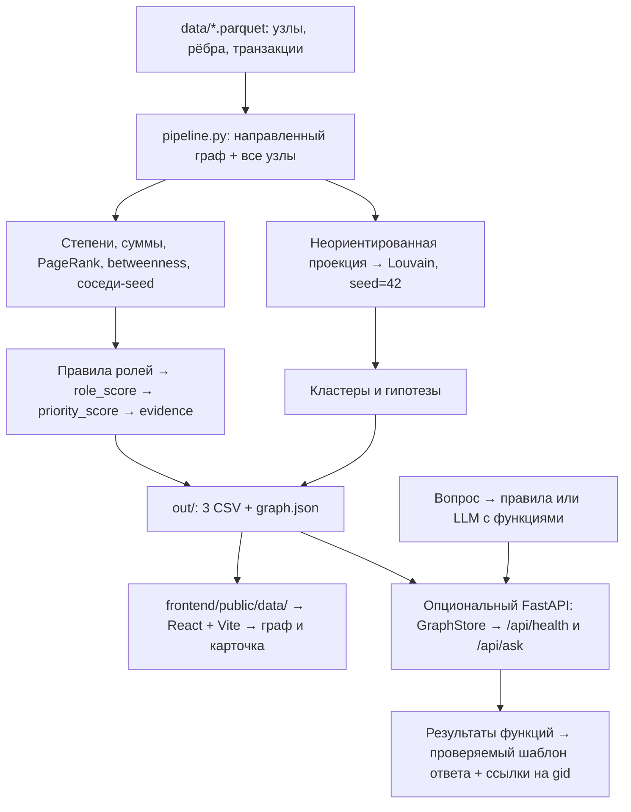

# Граф денег — MoneyGraph AI

Решение команды **STNDZ MAIN** для HackAlem AI. По обезличенной сети переводов инструмент помогает AML-аналитику ответить: **«кого смотреть первым и почему?»** Пайплайн рассчитывает структурные признаки, назначает объяснимую роль каждому узлу, выделяет сообщества и формирует топ-30 для проверки. Веб-интерфейс показывает направления переводов, роли, карточку и связи найденного клиента. Результат — гипотезы по наблюдаемым данным, а не утверждения о виновности.

Объяснение без технических подробностей: [как устроен проект, что должно быть на экране и кто за что отвечает](docs/PROJECT_EXPLAINED.md).

## Быстрый старт

Команды выполняются **из корня репозитория**. Нужен Python 3.10+ (проверенная среда: Python 3.12.10); для интерфейса — Node.js 22.12+ и npm. В `data/` должны лежать три исходных `.parquet`. После установки зависимостей аналитика и интерфейс работают локально, LLM и GPU не требуются.

### 1. От исходных данных до всех выгрузок — одна команда

Для Bash или PowerShell 7:

```sh
python -m pip install -r requirements.txt && python pipeline.py --data ./data --out ./out --no-viz
```

Для Windows PowerShell 5.1 (без поддержки `&&`):

```powershell
python -m pip install -r requirements.txt; if ($LASTEXITCODE -eq 0) { python pipeline.py --data ./data --out ./out --no-viz }
```

Рекомендуется предварительно создать виртуальную среду: `python -m venv .venv`. Активировать её в Bash: `source .venv/bin/activate`, в PowerShell: `.venv\Scripts\Activate.ps1`. Если активация недоступна, вместо `python` используйте `.venv/Scripts/python.exe` (Windows) или `.venv/bin/python` (Linux/macOS).

Команда создаёт `out/nodes_roles.csv`, `out/clusters.csv`, `out/top_nodes.csv`, `out/graph.json` и автоматически обновляет копии в `frontend/public/data/`. `--no-viz` отключает только дополнительный legacy PyVis HTML; данные React-интерфейса создаются всегда. Повторный запуск в установленной среде: `python pipeline.py --no-viz`.

### 2. Открыть интерфейс

```sh
npm --prefix frontend ci
npm --prefix frontend run dev
```

Откройте адрес Vite из терминала, обычно **http://localhost:5173**. Frontend читает статический `/data/graph.json`; FastAPI для этого сценария не нужен. После нового прогона пайплайна обновите страницу.

Сборка для показа без dev-сервера:

```sh
npm --prefix frontend run build
npm --prefix frontend run preview
```

Адрес preview обычно **http://localhost:4173**. Сборку выполняйте после генерации данных, чтобы она содержала актуальный JSON.

### 3. Проверить результат

```sh
python -m pip install -r backend/requirements.txt
python -m pytest tests/integration -v
```

Тесты запускают пайплайн дважды во временные каталоги с отдельным `--frontend`, проверяют лимит 300 секунд, побайтный детерминизм CSV, полноту узлов и кластеров, скоры, evidence, топ и ограничения данных. Рабочие выгрузки интерфейса при этом не перезаписываются.

**Известные блокеры текущего пайплайна:** 509 строк evidence не содержат чисел; один seed получает `transit`, хотя его входящие неполны. Эти проверки должны оставаться строгими. Подробности и требования к исправлению — в [delivery-статусе](docs/DELIVERY_STATUS.md). Полная приёмка до исправлений не закрыта.

## Схема решения



Аналитика: Python, pandas, NumPy, NetworkX, SciPy. Интерфейс: React 19, Vite, react-force-graph-2d. Backend читает готовые результаты и строит индексы по строковому идентификатору и входящим/исходящим связям; роли и скоры не пересчитывает.

## Входные данные

| Файл | Строк | Поля |
|---|---:|---|
| `data/nodes.parquet` | 2 248 | `gid`, `depth`, `is_seed` |
| `data/edges.parquet` | 3 119 | `src`, `dst`, `sum_kzt`, `n_tx`, `depth` |
| `data/transactions.parquet` | 4 840 | `src`, `dst`, `date`, `sum_kzt` |

81 seed, период **1–31 июля 2026**, сумма рёбер **365 890 012,01 KZT** в текущей выгрузке. Ребро направлено от плательщика к получателю; его сумма и число транзакций агрегированы за период. Стартовый код организаторов — в `starter/`, полное ТЗ — в [context/TASK.md](context/TASK.md).

`gid` — идентификатор, а не число для вычислений: в JSON и API он передаётся **строкой**. При чтении CSV явно задавайте строковый тип (`pd.read_csv(path, dtype={"gid": "string"})`); табличные редакторы и JavaScript number могут потерять младшие разряды 18-значного идентификатора.

## Признаки и критерии ролей

Ниже описан **фактический `pipeline.py`**, а не целевые правила из плана команды.

| Обозначение | Расчёт |
|---|---|
| `i`, `o` | `in_deg`, `out_deg`: число разных плательщиков и получателей |
| `I`, `O` | `in_kzt`, `out_kzt`: суммы входящих и исходящих рёбер |
| `p` | `pass_through = O / I`, если `I > 0`; иначе не определён |
| `s` | `seed_neighbors`: число уникальных seed среди соседей в любом направлении, один шаг |
| `b`, `q` | betweenness узла и её 95-й перцентиль по всем узлам |
| `t` | `truncated_by_depth = (depth == 4 and o == 0)` |
| `sink` | `o == 0 and i > 0 and not t` |

PageRank учитывает направление переводов и веса `sum_kzt`. Betweenness сейчас считается **точно**, на направленном графе с `weight="sum_kzt"`: сумма интерпретируется как длина пути, поэтому это не поиск маршрута с максимальным денежным потоком. Метрики всех 19 изолированных узлов также попадают в итоговую таблицу.

### Роли: первое совпавшее правило побеждает

| Порядок | Роль | Условие | Интерпретация для проверки |
|---:|---|---|---|
| 1 | `consolidator` | `i ≥ 5` и `i ≥ o` | Признаки сбора от нескольких плательщиков |
| 2 | `distributor` | `o ≥ 10` | Признаки веерного распределения |
| 3 | `consolidator` | `i ≥ 5` | Сбор при наличии дальнейших переводов |
| 4 | `coordinator` | `(s ≥ 3 или (b ≥ q и b > 0 и i + o ≥ 4))` и `i + o > 0` | Структурный посредник / связь с несколькими seed |
| 5 | `transit` | `i > 0`, `o > 0`, `p` определён, `0.8 ≤ p ≤ 1.2`, `not t` | Сопоставимые входящий и исходящий обороты |
| 6 | `terminal` | `sink` и (`i ≥ 2` или `I ≥ 100 000 KZT`) | Признаки оседания в пределах наблюдаемой выборки |
| 7 | `peripheral` | `t` | Граница обхода, дальнейшее движение неизвестно |
| 8 | `peripheral` | `sink` | Входящий поток ниже порогов `terminal` |
| 9 | `peripheral` | `i == 0` и `o == 0` | Нет рёбер в выгрузке |
| 10 | `peripheral` | Всё остальное | Выраженное правило не сработало |

Например, узел с большим числом входов и выходов может получить `consolidator` или `distributor` раньше проверки `coordinator`. Названия описывают структурную гипотезу, а не установленную функцию клиента.

**Отличия от целевого плана:** отдельная роль `boundary` пока не реализована; все 444 обрезанных узла текущего набора имеют `peripheral` и флаг `truncated_by_depth`, ни один — `terminal`. В правиле `transit` пока отсутствует исключение `is_seed`; это известный дефект, а не корректное допущение модели.

### Как получается `role_score`

`clip(x) = max(0, min(1, x))`. Итог округляется до четырёх знаков. Это эвристический скор выполнения правила, **не вероятность виновности и не откалиброванная вероятность роли**.

| Ветка таблицы выше | Формула до округления |
|---|---|
| 1: сбор | `clip(0.5 + 0.03·min(i, 20) + 0.2·max(1 − O/I, 0))` (при `I == 0` удержание принимается за 0) |
| 2: распределение | `clip(0.5 + 0.004·min(o, 120))` |
| 3: сбор с дальнейшим движением | `clip(0.45 + 0.025·min(i, 20))` |
| 4: координация | `clip(0.55 + 0.08·min(s, 6) + 0.25·min(b/(q + 1e−12), 1))` |
| 5: транзит | `clip(0.55 + 0.2·(1 − abs(p − 1)))` |
| 6: оседание | `clip(0.4 + 0.02·min(i, 10) + 0.1·min(I/1 000 000, 1))` |
| 7 / 8 / 9 / 10: периферия | `0.2 / 0.25 / 0.1 / 0.15` соответственно |

`evidence` строится шаблоном соответствующей ветки и обрезается до 200 символов. Степени, суммы и коэффициенты берутся из рассчитанных признаков. Для двух общих шаблонов пока требуется добавить числовое обоснование — см. delivery-статус.

## Приоритет: кого смотреть первым

Функция `priority_score()` использует нормировку на **максимум по всем узлам**, а не перцентильные ранги:

```text
degree = in_deg + out_deg
volume = in_kzt + out_kzt

structure = 0.35 · pagerank / max(pagerank)
          + 0.25 · degree   / max(degree)
          + 0.25 · volume   / max(volume)

seed_boost = 0.15 · min(seed_neighbors / 5, 1) + 0.10 · is_seed
trunc_penalty = 0.15, если truncated_by_depth, иначе 0

priority_score = round(clip(
    0.45 · role_weight + 0.40 · structure + seed_boost
    + 0.10 · role_score − trunc_penalty
), 4)
```

Если максимум равен нулю, знаменатель заменяется на 1. `is_seed` в формуле — 0 или 1.

| Роль | `role_weight` |
|---|---:|
| `coordinator` | 1.00 |
| `consolidator` | 0.95 |
| `distributor` | 0.85 |
| `transit` | 0.55 |
| `terminal` | 0.45 |
| `peripheral` | 0.15 |

Сортировка топ-30: сначала `priority_score`, при равенстве — `role_score`, оба по убыванию. Приоритет сочетает назначенную роль, структуру, оборот и соседство с seed. В текущей формуле **сам seed получает прибавку 0.10**; это отличается от понижения известных узлов в командном плане. Betweenness влияет через роль и её скор, но отдельного слагаемого в `structure` не имеет.

## Кластеры

`nx.community.louvain_communities(G.to_undirected(), weight="sum_kzt", seed=42)`. Сообщества сортируются по размеру по убыванию, каждому присваивается `cluster_id`. В текущей выгрузке 87 кластеров; 19 изолированных узлов включены в граф до расчёта и образуют отдельные сообщества.

Направление учитывается в признаках и ролях, кластеризация работает на **неориентированной проекции**. При встречных рёбрах `G.to_undirected()` не суммирует их веса; внутренний оборот кластера, напротив, считается по всем исходным направленным рёбрам с обоими концами внутри кластера.

`hypothesis` — шаблон по составу сообщества: минимум 3 seed и консолидатор → гипотеза ядра с консолидацией; иначе минимум 2 распределителя → фрагмент распределения; иначе наличие seed → окружение seed; иначе → периферийное сообщество. Это не доказательство общей организации. `top_gids` содержит до пяти узлов кластера с наибольшим приоритетом.

## Выгрузки и контракт данных

| Файл | Содержание |
|---|---|
| `out/nodes_roles.csv` | 2 248 строк; обязательные `gid, role, role_score, cluster_id, priority_score, evidence`, дополнительные колонки с признаками |
| `out/clusters.csv` | `cluster_id, n_nodes, n_seed, sum_kzt_internal, top_gids, hypothesis`; `top_gids` — строка с разделителем `;` |
| `out/top_nodes.csv` | 30 строк: `rank, gid, role, priority_score, why` |
| `out/graph.json` | Полные данные интерфейса: `meta, nodes, links, top, clusters, timeseries, transactions` |
| `frontend/public/data/` | Копии трёх CSV и JSON для статической загрузки интерфейсом |

Фактический JSON использует `nodes[].id` и `links[].source/target` (строки), `sum_kzt` и `n_tx` на связях. Признаки узла лежат непосредственно в объекте узла. В `top` идентификатор называется `gid`, в `transactions` — `src/dst`. Формат отличается от эскиза `gid / edges / metrics` в плане команды; потребители должны ориентироваться на экспорт `export_frontend()`.

## Сценарий для аналитика и демо

1. Запустите пайплайн, покажите три CSV и топ-30.
2. Возьмите полный `gid` из выгрузки или выбранный жюри; вставьте в поиск. Полный идентификатор устраняет неоднозначность поиска по фрагменту.
3. В режиме **Hunt** покажите найденный узел и дерево его связей, направление стрелок, роль, входящие/исходящие суммы и evidence в карточке. Ветки раскрываются при выборе узлов.
4. Переходите по контрагентам из истории транзакций или агрегатов связей. В агрегатах показано до восьми крупнейших входящих и восьми исходящих связей; полная история — в таблице карточки.
5. Сравните узел с `truncated_by_depth` и узел `terminal`, объясните различие между отсутствием наблюдений и признаком оседания.

**Network** показывает топ-узлы с окружением, максимум 320 узлов. Цвет кодирует роль, размер зависит от приоритета, seed и выделения. В панели приоритетов показаны первые восемь строк, все 30 доступны в CSV/JSON. Номер кластера есть в карточке; гипотезы кластеров доступны в выгрузках.

Индикаторы `Δ` в текущем UI вычисляются декоративно из долей/скоров и **не являются измеренной динамикой**. Для числового обоснования используйте признаки, evidence и реальные транзакции; требование к корректировке UI записано в delivery-статусе.

## Ограничения данных и метода

- **Обход только по исходящим на четыре колена.** У 444 узлов `depth=4` исходящие не собирались. `truncated_by_depth` обозначает эту неполноту; нулевой наблюдаемый выход не доказывает оседание.
- **Неполные входящие, особенно у seed.** `I − O` — сальдо внутри выборки, не банковский баланс. 354 узла по ТЗ отправляют больше, чем получают в наблюдаемых данных. `pass_through` не доказывает транзит тех же денег.
- **Порог 5 000 KZT, один банк, один месяц.** Дробление ниже порога, переводы в другие банки и за пределами июля невидимы. Даже `terminal` — гипотеза только в этих пределах.
- **19 изолированных seed сохранены.** Им назначается `peripheral`, они входят в CSV и кластеры. Отсутствие рёбер не означает отсутствия активности вне выборки.
- **Нет клиентских атрибутов и размеченных ролей.** Пороги эвристические, quality/accuracy на ground truth не измерены. Нормировка приоритета по максимуму чувствительна к крупным узлам и изменению выборки.
- **Часть признаков плана пока отсутствует.** `ext_inflow`, `seed_reach2`, `fast_share` и `sync_in_max` не рассчитаны; календарная история переводов сама по себе не является детектором сквозного транзита.
- **Воспроизводимость проверяется в одной среде.** Louvain использует `seed=42`; тест сравнивает два прогона CSV. Зависимости заданы нижними границами версий, поэтому побайтное совпадение между разными версиями библиотек не гарантируется. В проверенной среде: pandas 3.0.6, NetworkX 3.7.

## Масштабирование до ~1 млн узлов

Это план развития, а не заявленный результат бенчмарка. Требования к памяти и времени зависят также от числа рёбер и транзакций.

| Компонент сейчас | Изменение на большом графе |
|---|---|
| pandas, загрузка всего набора | Polars lazy / DuckDB, чтение нужных колонок Parquet, агрегирование по частям; степени и суммы считаются за `O(V + E)` |
| NetworkX и Python-объекты | Компактные индексы/CSR, igraph либо nx-cugraph на GPU при наличии ресурсов; сохранить соответствие строковых gid внутренним индексам |
| Точная взвешенная betweenness | Приближённая оценка по выборке `k` источников с фиксированным seed; измерить стабильность топа и время при разных `k` |
| Louvain | Leiden в подходящем движке; заново проверить качество сообществ и интерпретацию встречных рёбер |
| Полный `graph.json` в памяти API и браузера | Хранилище узлов/рёбер с индексами по gid, src, dst; постраничные запросы и кэш ограниченных окрестностей |
| Передача всех транзакций в UI | Подгрузка истории по узлу и периоду; агрегация для обзора |
| Отрисовка подграфа | Сохранить локальные окрестности/топ-N, добавить агрегированные узлы кластеров и жёсткие лимиты выдачи |

Перед переносом: убрать привязку выходной проверки пайплайна к 2 248 строкам, измерить wall time и пик RAM на синтетических графах нескольких размеров, сравнить топы/роли с малым эталоном. Лимит менее пяти минут относится к предоставленному набору; миллион узлов здесь не тестировался. GPU — возможная оптимизация, а не обязательное условие запуска.

## Опциональный backend

```sh
python -m pip install -r backend/requirements.txt
python -m uvicorn backend.main:app --port 8000
```

В другом терминале: `curl http://localhost:8000/api/health` (в Windows при необходимости `curl.exe`). Ожидаются `status: "ok"`, `nodes: 2248`, `links: 3119`; поле `source` указывает выбранную выгрузку. Swagger: **http://localhost:8000/docs**.

`GraphStore` сначала ищет `out/graph.json`, затем копию `frontend/public/data/graph.json`. Данные загружаются при старте; после пересчёта нужен перезапуск сервера. Если файла нет, сначала выполните пайплайн.

### Copilot: `POST /api/ask`

Без настройки LLM работает разбор типовых вопросов по правилам. Локальная модель Ollama может работать в режиме `llm` без ключа — см. ниже. Пример в PowerShell:

```powershell
Invoke-RestMethod -Method Post -Uri http://localhost:8000/api/ask -ContentType 'application/json; charset=utf-8' -Body '{"question":"Топ 5 по priority_score","selected_gid":null}'
```

В Bash:

```sh
curl -sS http://localhost:8000/api/ask -H 'Content-Type: application/json' -d '{"question":"Топ 5 по priority_score","selected_gid":null}'
```

Поддерживаются карточка узла, входящие/исходящие соседи, общие прямые получатели указанных узлов, топ по метрике и направленный путь. Для вопросов с gid подставляйте полный идентификатор из выгрузки. Запросы можно выполнять и через Swagger.

Для LLM с OpenAI-совместимым Chat Completions и поддержкой tool calling задайте переменные **перед запуском сервера** или запишите их в локальный `backend/.env` (исключён из Git). Переменные процесса имеют приоритет над файлом:

| Переменная | Значение |
|---|---|
| `LLM_PROVIDER` | `openai` (по умолчанию) или `ollama` для локальной модели без ключа |
| `LLM_BASE_URL` | Базовый URL API с префиксом, например `https://api.openai.com/v1`; приложение добавляет `/chat/completions` |
| `LLM_API_KEY` | Ключ внешнего провайдера; для Ollama оставляется пустым. В режиме `openai` пустой ключ включает разбор по правилам |
| `LLM_MODEL` | Идентификатор модели у выбранного провайдера |
| `LLM_TIMEOUT_SECONDS` | Общий лимит времени планирования одного вопроса, по умолчанию 30 секунд |

LLM выбирает функции `get_node`, `neighbors`, `common_collectors`, `top_by`, `path`. Ссылки на gid разрешены только из вопроса, контекста выбранного узла или уже полученных результатов. Итоговые суммы, связи и карточки строятся серверными шаблонами **из результатов функций**; произвольный финальный текст модели не используется. При ошибке провайдера или некорректном вызове срабатывает фолбэк на правилах.

Согласованный запрос: `{"question": "...", "selected_gid": null}`. Вместо `null` можно передать строковый gid выбранного узла и спросить «Кому он отправляет?»; явные gid в вопросе имеют приоритет перед выделением. Ответ содержит ровно `answer`, `gids` (строковые идентификаторы упомянутых в ответе существующих узлов), `mode` (`llm` или `rules`). Фолбэк тоже имеет `mode="rules"`; причина включается в текст `answer`. Роли сохраняются из выгрузки, в том числе её известные дефекты. Разработка Copilot разрешена параллельно устранению блокеров аналитики; полной приёмки это не заменяет.

Подробный контракт, лимиты и примеры вопросов: [docs/COPILOT_API.md](docs/COPILOT_API.md). React-интерфейс пока использует только статические данные; Copilot доступен через API/Swagger.

### Локальная LLM без API-ключа

Установите [Ollama](https://ollama.com/download), затем из корня репозитория:

```sh
ollama pull qwen3:4b
ollama create moneygraph-qwen3:4b -f backend/ollama.Modelfile
```

Скопируйте `backend/.env.example` в `backend/.env`, если локального файла ещё нет, и перезапустите FastAPI. Профиль использует Ollama на `http://127.0.0.1:11434/v1`, реальный API-ключ не нужен.

Проверить именно LLM, а не фолбэк:

```sh
python -m backend.check_copilot --all
```

Команда проверяет пять типов вопросов и возвращает ошибку при `mode="rules"`. Установка, настройки, диагностика и воспроизводимый запуск описаны в [docs/OLLAMA_SETUP.md](docs/OLLAMA_SETUP.md).
